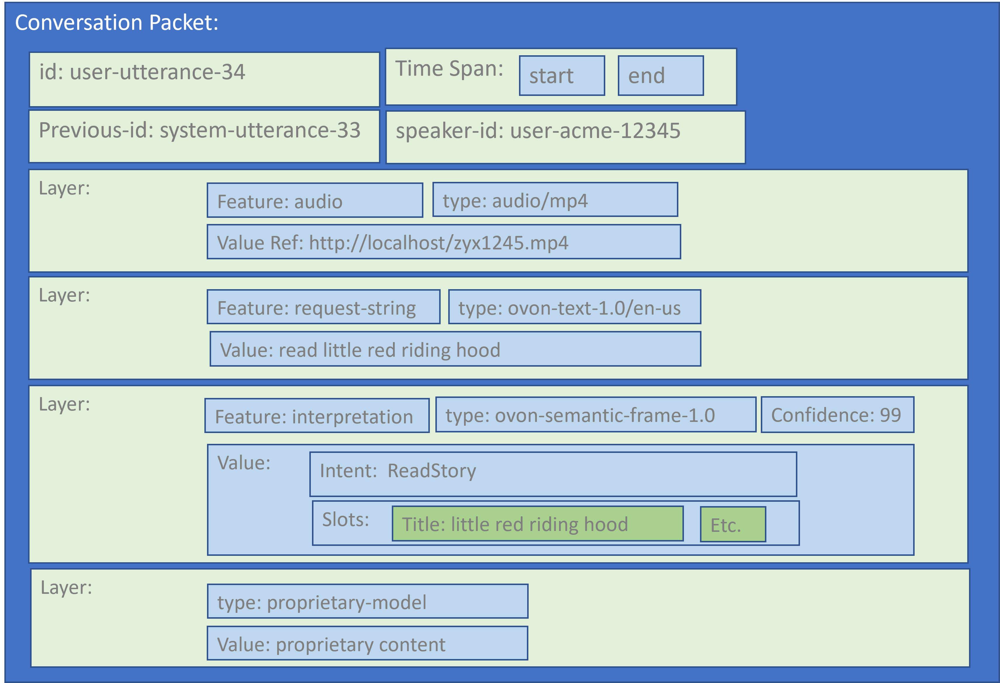
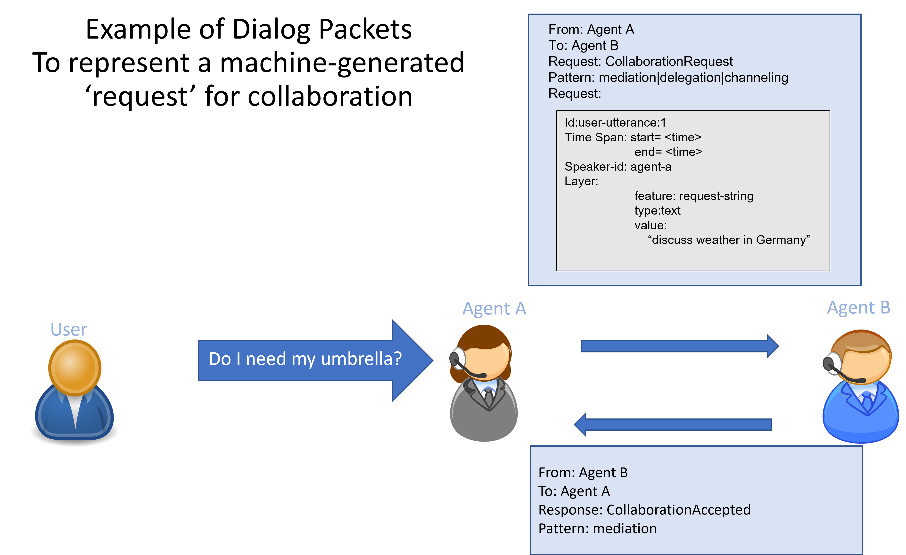

# Interoperable Dialog Packet Requirements
**The Open Voice Network**
**Architecture Work Group of the Technical Committee**

|||
|-|-|
|Status|Draft| 
|Version|1.0|
|Date|November 30, 2022|

# Table of Contents 

0. SCOPE, PURPOSE AND DESIGN						
    1. [Document Scope](#chapter-0---scope-purpose-and-design)							
    2. [Purpose of a Dialog Packet](#02-purpose-of-a-dialog-packet)						
    3. [Design Principles](#03-design-principles)							
1. [EXAMPLES AND USE CASES](#chapter-1---examples-and-use-cases)
    1. [Examples of Layers](#11-examples-of-layers)
    2. [Example Packet](#12-example-packet)
    3. [Example Use Cases](#13-example-use-cases)	
    4. [Agent Collaboration Request/Response](#14-agent-collaboration-requestresponse)	
    5. [User Request Utterances and System Output Utterances](#15-user-request-utterances-and-system-output-utterances)		
2.  [REQUIREMENTS AND SPECIFICATIONS](#chapter-2---requirements-and-specifications)
    1. [OVON Specifications Building on Core Packet Specification](#21-ovon-specifications-building-on-core-packet-specification)
    2. [Requirements for Core Dialog Packets](#22-requirements-for-core-dialog-packets)							
3. [KNOWN ISSUES](#chapter-3---known-issues)

# Chapter 0 - Scope, Purpose and Design

## 0.1 Document Scope

This document is intended to capture the requirements for Open Voice Network (OVON) interoperable dialog packets.  These requirements are intended to describe the functional behavior of collaborating voice systems and must not be construed at this point to define particular protocols. The requirements will form the basis of a detailed specification to follow.  The intended readership is anyone who has a specific interest in the direction and content of OVON standards regarding the interoperability of dialog agents.

## 0.2 Purpose of a Dialog Packet

Interoperable conversational agents will need to process user inputs that may have been collected by another conversational agent. In order to do this, agents must agree on a format for representing user inputs that all conversational agents that conform to OVON interoperability standards can understand. The purpose of a dialog packet is to define a generic standardized data structure that can be used in any part of a dialog system to express a ‘language event,’ that is to say any information associated with a phrase, utterance or part of an utterance.  These could be user or system events.  Dialog packets span a certain time period and are associated with a single speaker. 

These packets can be used to express whole utterances, phrases or slices of time in a stream. These packets are used to represent user inputs of various types, primarily linguistic inputs such as speech or text, but also potential multimodal inputs, such as selections on a touchscreen. This document will focus on speech and text, while not ruling out multimodal inputs.

Packets could be joined together to form streams, for example to represent continuous input or output of a dialog system.

Initially, it is envisaged that the following OVON protocols will use dialog packets.

* Agent collaboration request/response (e.g. request and accept delegation)
* User request utterances
* System output utterances
* Representation of dialog history

Dialog packets contain layers that are intentionally extensible. Some layers might be mandated for certain uses of a dialog packet, others might be optional, yet other layers might be proprietary.  Recipients of packets may make use of as little or as much of a packet, depending on the case at hand.

Packets carry information about utterances from any speaker in a dialog, including automated agents and users.

## 0.3 Design Principles

* Simple things should be simple and complex things should be possible.
* The requirements will support present technology.
* The requirements will allow for future technical evolution.

# Chapter 1 - Examples and Use Cases

## 1.1 Examples of Layers

* Audio (e.g. wav, mp3 or packetised audio)
* Text (orthographics)
* Pronunciation
* Slot/value semantics
* Thingpedia semantics
* User gesture

Layers have schemas describing the formats of their content.  Specializations of each schema may also be needed. For example:

* Domain-specific semantic symbol sets (e.g. medical records, geolocation, address info, WoT)
* Language-specific orthographic specifications
* Different pronunciation symbol sets

## Additional standardized layers can be added as state of the art changes (e.g. logical form semantics, prosodics, gesture, etc.)

Additional proprietary layers can also be added arbitrarily, if the packets are passing between components in a single ecosystem.

## 1.2 Example Packet

Figure 1: An example of a logical view of a packet, illustrating the information requirements of a dialog packet 

This logical view shown in Figure 1 could be realized in many different actual data models, and readers should not infer any design or syntactic constraints from it.   

## 1.3 Example Use Cases

We envisage that the dialog packet format will be useful for any protocol carrying linguistic information. The potential uses of this standard are therefore many.

More specifically, it is intended as a fundamental data structure that can be used within several other higher level standards under development by OVON. 

### 1.4 Agent Collaboration Request/Response

Figure 2 shows how a packet can be used in a collaboration request to represent the ‘ask’ from one system to the other. This is not a user input but a string representing the action that Agent A would like to request of Agent B.  It is expressed in language, and hence we use a packet to express it.  In some cases this might be user language but we deliberately show a machine generated utterance here to highlight the distinction.

Figure 2: Use of a packet in a collaboration request between agents

### 1.5 User Request Utterances and System Output Utterances

Figure 3 shows a schematic example of how packets could be used to represent the actual user input to a dialog system. In this case it is an utterance from one agent to another in a mediated dialog after the collaboration request has been accepted.  

Figure 3: A core packet uses a whole turn user-input to a dialog system. The system response will also be represented as a whole-turn packet. 

# Chapter 2 - Requirements and Specifications 

## 2.1 OVON Specifications Building on Core Packet Specification

We expect OVON to specify any layers required to implement higher level OVON  protocols and use cases, for example text and semantics.

### As an example, the following might be a sequence of specifications from OVON.

* OVON core dialog packet specification (these requirements) 
* Followed by layer specifications
    * OVON text layer specification
    * OVON slot-value/semantic frame layer specification
    * OVON audio layer spec (streamed or file based)
* Other specifications may emerge over time as the need emerges. Examples include but are not limited to:
    * Pronunciation layer specification
    * Paralinguistic events (laughs, coughs, etc.) 
    * Thingpedia Semantics layer specification

## 2.2 Requirements for Core Dialog Packets

_MUST, MAY, SHOULD characterizations in this document refer to whether or not the spec supports the feature, not whether an implementation supports the feature._

The core requirements for any dialog packet are as follows:

* Each packet:
    * Spans a particular time period in universal time (start and end)  (MUST)
    * Represents a portion or all of an utterance or other user input (MUST)
    * Has zero or many layers of information (MUST)
    * Is associated with a single speaker (MUST)
    * Can be uniquely identified (MAY)
* Each layer has:
    * A defined schema and syntax for the content (type) (MUST)
    * The content for this layer for this time period (MUST) be
    * (Either) Inline Content
    * (Or) Indirect Reference to content elsewhere (but not both)
    * The ability to represent confidence (MAY)
    * (Either) Entire layer
    * (And/Or) Individual Items in the layer
    * The ability to represent alternates (MAY)
    * (Either) Alternates for an entire layer, for example, an n-best list of speech recognition results
    * (Or) Alternates for individual items in the layer (but not both)
* Links between layers in the same packet (MAY)
    * (Either) Link items in one layer to one or more items in another layer.
    * (And/Or) Assign a timespan to items in a layer
* Links between items between packets (MAY)
    * Link one or more items in one layer in one packet to one or more items in an arbitrary layer in another packet, for example a link to the antecedent of a pronoun in an earlier packet. (MAY)
* Link between sequential packets from the same speaker (MAY)

## Chapter 3 - Known Issues

Future discussions will evaluate the pros and cons of  stand-off annotation versus inline annotation for linkage between layers. For example: SSML, Pronunciation ML and Emotion ML all use inline annotation schemes. Stand-off schemes are more versatile but quickly become unreadable.
